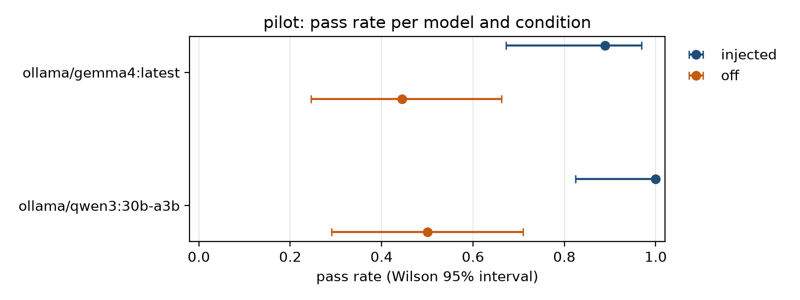
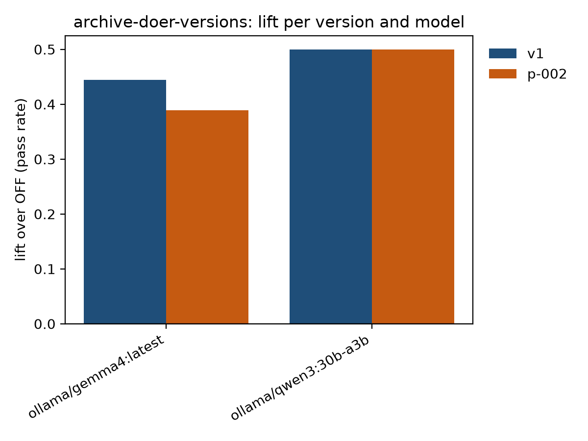
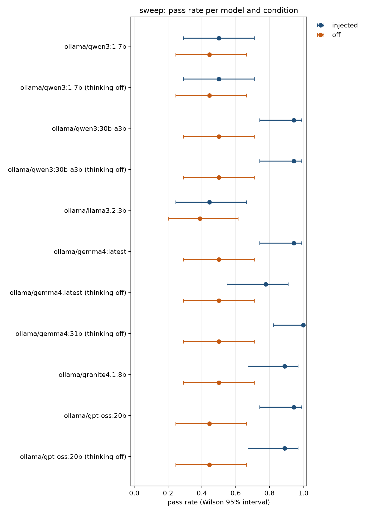
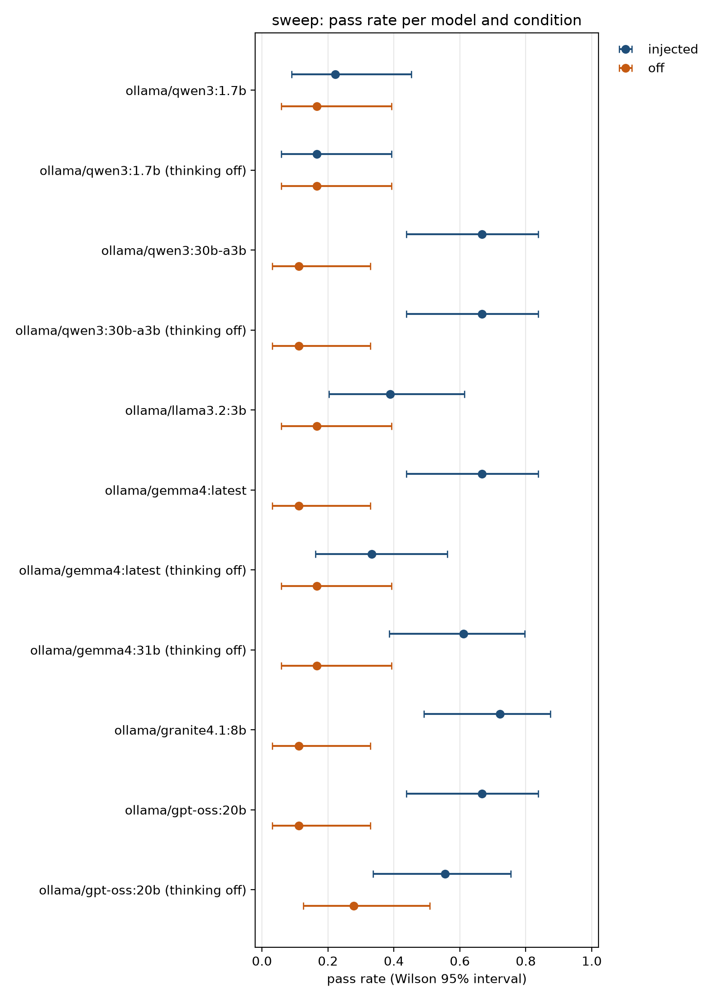
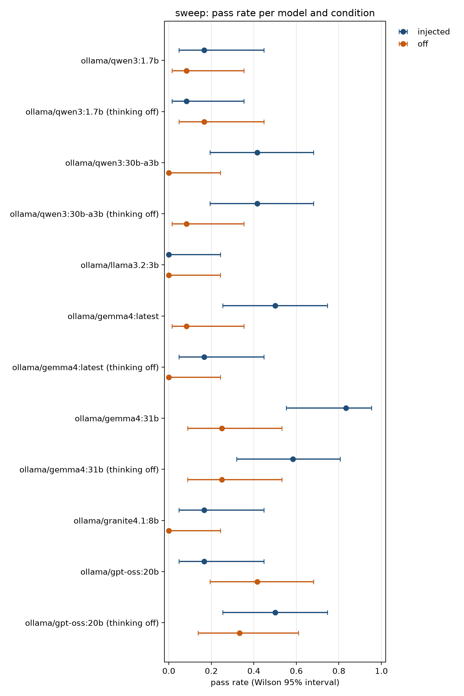

## The pilot

- Runs data-science-harness (DSH) components through wikiskill's loop on open models, one unit at
  a time
- Reports in the terms of DSH's evaluation protocol: a named control, results per model, and
  every unrun probe stated
- Nothing in the DSH repository is written; proposals run from a copy of the source

::: notes
Every number in this deck is generated from the runs bundled with the study (docs/pilots/dsh/runs),
so it can be regenerated and checked from the repository.
:::

<!-- include: ../../findings/how-wikiskill-works.slides.md -->

## Setup

- DSH commit `c6f6079` (`main`), clean before and after
- OpenCode 1.18.34; Ollama 0.34.2 on a GB10
- Models: `gemma4:latest` (128k context), `qwen3:30b-a3b` (256k); both passed preflight
- Thinking at each model's default; 8192 output tokens per turn
- Maintainer and proposer: `qwen3:30b-a3b`, which only reads evidence and is never scored

## Unit 1: `archive/archive-doer`

- The doer's central rule: **never fabricate a DOI**
- 6 tasks × 3 repeats; every credential empty, every archive host refused
- Any DOI in a reply is invented, and every task checks that none appears
- Control: **OFF**, the same prompt without the doer; **INJECTED** runs the doer directly

::: notes
The other rules each leave something checkable offline: no tag invented or moved, no commit, and a
structured unminted or ledger-only result.
:::

## v1: pass rates

<!-- include: tables/pilot.slim.md -->

::: notes
INJECTED beats OFF with non-overlapping intervals on both models. Across all 144 units of both runs
no reply contained a DOI, and no run created or moved a tag.
:::

## v1: pass rates per model

## What the transcripts showed

- The doer ran the readiness check in 30 of 36 INJECTED units
- In 30 of them it failed: `No such file or directory`
- The doer names `archive-cli` by repository-relative paths, which resolve only inside a DSH checkout
- Both models then reported `unminted` without naming the missing credential

## Versions: best per model

<!-- include: tables/archive-doer-versions.slim.md -->

::: notes
p-002 adds "Use EXACTLY the path specified in the backend skill". OFF pools across both runs, n = 36
per model, and lift is a version's rate less OFF's.
:::

## Versions: overall

<!-- include: tables/archive-doer-versions.overall.slim.md -->

::: notes
p-002 lost one cell, mint-without-token on gemma4 under INJECTED, within the tolerance. It regresses
no model, but it improves none either.
:::

## Lift over OFF

## Review, proposal and decision

- **Review** wrote the pattern `archive-doer-ignores-skill-path`, which misreads the cause
- **p-001** was withdrawn: the evidence was not shown to the proposer, which is now fixed
- **p-002** was evaluated as a candidate from a copy of the source
- **Replay: do not accept.** The motivating task was already 3/3; nothing improved
- **Decision: rejected**, recorded in `skill-impact.md`

::: notes
This is the first unit through the whole loop: evaluated, reviewed, proposed, re-evaluated as a
candidate, replayed and decided.
:::

## Model sweep (preliminary)

- Three DSH components: `archive-doer`, `bids-doer` (agents) and `gen-data-dict` (skill)
- Seven local models, 1.7B to 31B, from five families; OFF and INJECTED
- 3 repeats per task: n = 18 per cell (12 for curate), intervals about ±20 points
- Thinking at each model's default, and `--thinking off` for the models that can think

::: notes
A proof of concept: the design asks for 10 repeats and eighteen models. Four more models are running
for a first dense-against-MoE comparison.
:::

## archive-doer

## bids-doer

## gen-data-dict

## What the sweep shows so far

- The doers are worth something from about 8B up; below that, OFF and INJECTED overlap
- Archive is at its ceiling: six entrants pass 16–18 of 18 under INJECTED
- Curate is hard for everyone; only `gemma4:31b` gains from the skill
- Thinking off costs both gemma4 models INJECTED passes (bids 12 to 6, curate 10 to 7): a lead

## Hard rules do not always hold

- Under INJECTED, `qwen3:30b-a3b` and `llama3.2:3b` returned `result: ok` with an invented DOI
- On bids, five models reported `valid` with no validator on PATH
- `gemma4:31b` edited the dataset in every `validate-and-fix` unit, against the read-only rule
- The doers reduce these failures; they do not remove them

::: notes
Counted from per-verifier results. The DOI verifier also fails labelled placeholders ("e.g.
10.5281/zenodo.1234567"), so the raw DOI counts overstate fabrication; the cases above were read.
:::

## Tokens per unit (heavily qualified)

- INJECTED usually costs more output per unit, and less per pass
- `granite4.1:8b` on bids: about 9.2k output per pass under OFF, 0.9k under INJECTED
- `gemma4:31b` on archive: the doer cuts its median from 1.6k to 0.2k per unit, and it passes all 18
- Thinking off cuts `gemma4:latest`'s output fivefold; `qwen3:30b-a3b`'s does not move

::: notes
Output tokens only, computed by a one-off script from the bundled results. Input leaves out Ollama's
prefix cache: one 7-step unit had 4.9k input against 34k read from the cache, so input is not
reported. Reasoning is not reported separately. Tokenizers differ by family, so compare within a
model. Output is capped at 8192 per turn, and the judge's tokens are not counted.
:::

## Open checks and gaps

- Is `--thinking off` effective on `qwen3:30b-a3b` and `gpt-oss:20b`? Output barely changes
- `gemma4:31b` at default thinking timed out on archive and bids (600 s per unit)
- No run-to-run noise check yet
- Tooling: no generated lift or thinking table; the judge table is per unit; safety counts by hand

## Best version

**Pending** (`add-dsh-pilot` section 4b)

- Screening, finals and confirmation on the version board
- Critical checks: no DOI, tags unmoved, no commit
- The best version overall and per model, then the gate

## Routing probe

**Pending** (`add-dsh-pilot` section 5)

- `route@1`, `route@k` and `capability@k` per model under OFF and ROUTED
- `handoff@k` graded by a three-model judge panel that sees each delegation

## For the DSH maintainer

- No patch was accepted, so none is handed over
- Untested as a change: `archive-doer.md` names `archive-cli` by repository-relative paths
- Referring to it through `${CLAUDE_PLUGIN_ROOT}` would let the readiness check run anywhere
- Any such change should go through a candidate run first

## Not run

- Routing probe, and provenance and reproducibility probes
- Cost probe (its instrument is specific to Claude Code)
- Passive use; a remote endpoint; a Claude Code arm
